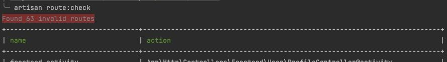

# Laravel Route Checker



Checks if your Laravel routes has valid controllers

## Installation

The package should be installed as a dev dependency, as there is no reason to have it installed in production.

```bash
composer require worksome/route-checker --dev
```

## Usage

To use the package simply run the following artisan command.

```bash
php artisan route:check
```
